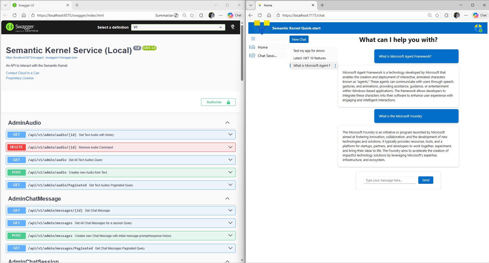

# Agent Framework C# Quick-Start
**Azure Bicep Infrastucture as Standalone Landing Zone**

[](https://github.com/goodtocode/agent-framework-quick-start/actions/workflows/gtc-agent-standalone-iac.yml)

**Clean Architecture C# Blazor Microapp and Web API Microservice**

[](https://github.com/goodtocode/agent-framework-quick-start/actions/workflows/gtc-agent-standalone-web-api-sql.yml)

Microsoft Agent Framework Quick-start is a 100% Microsoft, enterprise-ready starter kit for building modern, agentic applications with C#, Blazor (Fluent UI), and ASP.NET Core Web API. This solution demonstrates how to use the Microsoft Agent Framework to create a Copilot-style chat client, fully integrated with SQL Server for persistent storage of authors, chat sessions, and messages—all orchestrated through a clean architecture pattern. 

With built-in tools (plugins) for querying and managing your own data, automated Azure infrastructure (Bicep), and seamless CI/CD (GitHub Actions), this repo provides everything you need to build, deploy, and extend real-world AI-powered apps on a traditional .NET stack—no JavaScript, no raw HTML, just pure Blazor and Fluent UI. Perfect for teams looking to modernize with AI while leveraging familiar, pragmatic enterprise patterns.



Agent Framework is an SDK that integrates Large Language Models (LLMs) like OpenAI, Azure OpenAI, and Hugging Face with conventional programming languages like C#, Python, and Java. Agent Framework allows developers to define plugins that can be chained together in just a few lines of code.

[Introduction to Microsoft Agent Framework](https://learn.microsoft.com/en-us/agent-framework/overview/)

[Getting Started with Microsoft Agent Framework](https://learn.microsoft.com/en-us/agent-framework/get-started/quick-start-guide?pivots=programming-language-csharp)

# Quick-Start Steps
To get started, follow the steps below:
1. Clone this repository
	```
	git clone https://github.com/goodtocode/agent-framework-quick-start.git
	```
2. Install Prerequisites
	```
	winget install Microsoft.DotNet.SDK.10 --silent
	```
	```
	dotnet tool install --global dotnet-ef
	```
3. **Configure Entra External ID (EEID) Authentication**

	**IMPORTANT:** This product depends on Entra External ID. This means you must have an EEID tenant or create one at https://portal.azure.com. An empty tenant will work. Please remember to create a break-glass user as a backup in cse you get locked out. 
	
	Configure EEID authentication using one of the following methods:
	1. If you do not have app registrations, run `New-EntraAppRegistrations.ps1` to create both Web and API app registrations and set all user-secrets (admin consent required).
	```
	pwsh -File ./.azure/scripts/entra/New-EntraAppRegistrations.ps1 -EntraInstanceUrl "https://your-tenant-name.ciamlogin.com" -TenantId "<your-tenant-id>" -WebAppRegistrationName "myproduct-web-dev-001" -ApiAppRegistrationName "myproduct-api-dev-001" -WebProjectPath "../../src/Presentation.Blazor" -ApiProjectPath "../../src/Presentation.WebApi"
	```

	2. **OR** Run `Set-WebAppUserSecrets.ps1` and `Set-ApiAppUserSecrets.ps1` to set user-secrets from your account.
	```
	pwsh -File ./.azure/scripts/entra/Set-ApiAppUserSecrets.ps1 -TenantId "<your-tenant-id>" -ApiAppRegistrationName "myproduct-api-dev-001" -ApiProjectPath "../../src/Presentation.WebApi"
	```
	```
	pwsh -File ./.azure/scripts/entra/Set-WebAppUserSecrets.ps1 -TenantId "<your-tenant-id>" -WebAppRegistrationName "myproduct-web-dev-001" -WebProjectPath "../../src/Presentation.Blazor"
	```

	3. **OR** Manually set the required values using `dotnet user-secrets set` (or appsettings.local.json, not recommended for secrets).
	```
	cd src/Presentation.WebApi
	dotnet user-secrets init
	dotnet user-secrets set "EntraExternalId:Instance" "https://your-tenant-name.ciamlogin.com"
	dotnet user-secrets set "EntraExternalId:TenantId" "<your-tenant-id>"
	dotnet user-secrets set "EntraExternalId:ClientId" "<api-app-client-id>"
	dotnet user-secrets set "EntraExternalId:ValidateAuthority" "true"
	```

	```
	cd src/Presentation.WebApi
	dotnet user-secrets init
	dotnet user-secrets set "BackEndApi:ClientId" "<api-app-client-id>"
	dotnet user-secrets set "EntraExternalId:Instance" "https://your-tenant-name.ciamlogin.com"
	dotnet user-secrets set "EntraExternalId:TenantId" "<your-tenant-id>"
	dotnet user-secrets set "EntraExternalId:ClientId" "<web-app-client-id>"
	dotnet user-secrets set "EntraExternalId:ValidateAuthority" "true"
	dotnet user-secrets set "EntraExternalId:ClientSecret" "<web-app-client-secret>"

	cd ../../
	```

	See the **Authentication** section below for details and examples.

4. Add your Open AI or Azure Open AI key to configuration (via *dotnet user-secrets set* command)
	```
	cd src/Presentation.WebApi
	dotnet user-secrets set "OpenAI:ApiKey" "YOUR_API_KEY"
	```
	```
	cd ../Tests.Integration
	dotnet user-secrets set "OpenAI:ApiKey" "YOUR_API_KEY"
	```
5. Create your SQL Server database & schema (via *dotnet ef* command)
	```
	cd ../../
	dotnet ef database update --project .\src\Infrastructure.SqlServer\Infrastructure.SqlServer.csproj --startup-project .\src\Presentation.WebApi\Presentation.WebApi.csproj --context AgentFrameworkContext --connection "Data Source=(localdb)\MSSQLLocalDB;Initial Catalog=AgentFramework;Min Pool Size=3;MultipleActiveResultSets=True;Trusted_Connection=Yes;TrustServerCertificate=True;MultipleActiveResultSets=False;Encrypt=True;TrustServerCertificate=False;Connection Timeout=30"
	```
6. Run Tests (Tests.Integration)
	```
	cd src/Tests.Integration
	dotnet test
	```
7. Run Blazor Web Chat Client (Presentation.Blazor) and Web API (Presentation.WebApi)
	```
	cd ../
	dotnet run --project Presentation.WebApi/Presentation.WebApi.csproj
	dotnet run --project Presentation.Blazor/Presentation.Blazor.csproj
	```
	**Note:** By default, Presentation.WebApi runs on https://localhost:6075 and Presentation.Blazor runs on https://localhost:7175 unless configured otherwise.

# Install Prerequisites
You will need the following tools:
## Visual Studio
[Visual Studio Workload IDs](https://learn.microsoft.com/en-us/visualstudio/install/workload-component-id-vs-community?view=vs-2022&preserve-view=true)
```
winget install --id Microsoft.VisualStudio.2022.Community --override "--quiet --add Microsoft.Visualstudio.Workload.Azure --add Microsoft.VisualStudio.Workload.Data --add Microsoft.VisualStudio.Workload.ManagedDesktop --add Microsoft.VisualStudio.Workload.NetWeb"
```

## .NET SDK
```
winget install Microsoft.DotNet.SDK.10 --silent
```

## dotnet ef cli
Install
```
dotnet tool install --global dotnet-ef
```

## SQL Server
Visual Studio installs SQL Express. If you want full-featured SQL Server, install the SQL Server Developer Edition or above.

[SQL Server Developer Edition or above](https://www.microsoft.com/en-us/sql-server/sql-server-downloads)


# Authentication (Entra External ID)

This project uses Entra External ID (EEID) for authentication. You only need to complete ONE of the following methods (they are alternatives, not cumulative). **The preferred approach is to use the script to create both app registrations, as this will configure all required claims, roles, and scopes custom to this quick-start.**

**1. Create both app registrations and configure automatically (recommended for most users):**

If you do not have app registrations, run the script below to create both Web and API app registrations and set all user-secrets (admin consent required):

```
pwsh -File ./.azure/scripts/entra/New-EntraAppRegistrations.ps1 -EntraInstanceUrl "https://your-tenant-name.ciamlogin.com" -TenantId "<your-tenant-id>" -WebAppRegistrationName "myproduct-web-dev-001" -ApiAppRegistrationName "myproduct-api-dev-001" -WebProjectPath "../../src/Presentation.Blazor" -ApiProjectPath "../../src/Presentation.WebApi"
```

You will be prompted to grant admin consent in the Azure Portal twice (once for each app registration: Web and API). Look for a console message like this for each app:

```
ACTION REQUIRED: Grant admin consent for Web app permissions in the Azure Portal:
Open the following URL in your browser:
https://portal.azure.com/#view/Microsoft_AAD_RegisteredApps/ApplicationMenuBlade/~/Permissions/appId/<API or WEB APPID>/isMSAApp~/false
Then click 'Grant admin consent for ...' in the API permissions blade.
```
The script will output a summary table with all relevant IDs (TenantId, Instance, AppIds, ObjectIds, Redirect URIs, etc.) for your reference.

**2. OR: Use existing app registrations and configure .NET secrets:**

If you already have app registrations, run the following scripts to set user-secrets from your account:

```
pwsh -File ./.azure/scripts/entra/Set-ApiAppUserSecrets.ps1 -TenantId "<your-tenant-id>" -ApiAppRegistrationName "myproduct-api-dev-001" -ApiProjectPath "../../src/Presentation.WebApi"
```
```
pwsh -File ./.azure/scripts/entra/Set-WebAppUserSecrets.ps1 -TenantId "<your-tenant-id>" -WebAppRegistrationName "myproduct-web-dev-001" -WebProjectPath "../../src/Presentation.Blazor"
```

**3. OR: Configure everything manually:**

Set the required values using `dotnet user-secrets set` (or appsettings.local.json, not recommended for secrets):

```
cd src/Presentation.WebApi
dotnet user-secrets init
dotnet user-secrets set "EntraExternalId:Instance" "https://your-tenant-name.ciamlogin.com"
dotnet user-secrets set "EntraExternalId:TenantId" "<your-tenant-id>"
dotnet user-secrets set "EntraExternalId:ClientId" "<api-app-client-id>"
dotnet user-secrets set "EntraExternalId:ValidateAuthority" "true"
```

```
cd src/Presentation.WebApi
dotnet user-secrets init
dotnet user-secrets set "BackEndApi:ClientId" "<api-app-client-id>"
dotnet user-secrets set "EntraExternalId:Instance" "https://your-tenant-name.ciamlogin.com"
dotnet user-secrets set "EntraExternalId:TenantId" "<your-tenant-id>"
dotnet user-secrets set "EntraExternalId:ClientId" "<web-app-client-id>"
dotnet user-secrets set "EntraExternalId:ValidateAuthority" "true"
dotnet user-secrets set "EntraExternalId:ClientSecret" "<web-app-client-secret>"

cd ../../
```

**EEID configuration values include:**
	- Entra Instance URL
	- Tenant ID
	- Client IDs for Web and API
	- Client secrets (if applicable)
	- Redirect URIs
	- API scopes

**Note:**
- You must use the correct Entra instance and tenant for your environment.
- The app registration names and GUIDs in the script are examples—replace them with your own values.
- For more details on Entra External ID, see [Microsoft Entra External ID documentation](https://learn.microsoft.com/en-us/azure/active-directory/external-identities/).

# Configure API Key and Connection String
Follow these steps to get your development environment set up:

## ASPNETCORE_ENVIRONMENT set to "Local" in launchsettings.json
1. This project uses the following ASPNETCORE_ENVIRONMENT to set configuration profile
- Debugging uses Properties/launchSettings.json
- launchSettings.json is set to Local, which relies on appsettings.Local.json
2. As a standard practice, set ASPNETCORE_ENVIRONMENT entry in your Enviornment Variables and restart Visual Studio
	```
	Set-Item -Path Env:ASPNETCORE_ENVIRONMENT -Value "Development"
	Get-Childitem env:
	```	
  
## Setup Azure Open AI or Open AI configuration
**Important:** Do this for both Presentation.WebApi and Tests.Integration
### Azure Open AI
```
cd src/Presentation.WebApi
dotnet user-secrets set "AzureOpenAI:ChatDeploymentName" "gpt-4"
dotnet user-secrets set "AzureOpenAI:Endpoint" "https://YOUR_ENDPOINT.openai.azure.com/"
dotnet user-secrets set "AzureOpenAI:ApiKey" "YOUR_API_KEY"
cd ../Tests.Integration
dotnet user-secrets set "AzureOpenAI:ChatDeploymentName" "gpt-4"
dotnet user-secrets set "AzureOpenAI:Endpoint" "https://YOUR_ENDPOINT.openai.azure.com/"
dotnet user-secrets set "AzureOpenAI:ApiKey" "YOUR_API_KEY"
```
Alternately you can set in Environment variables
```
AzureOpenAI__ChatDeploymentName
AzureOpenAI__Endpoint
AzureOpenAI__ApiKey
```

### Open AI
Set API Key in both Presentation.WebApi and Tests.Integration projects
```
cd src/Presentation.WebApi
dotnet user-secrets set "OpenAI:ApiKey" "YOUR_API_KEY"
cd ../Tests.Integration
dotnet user-secrets set "OpenAI:ApiKey" "YOUR_API_KEY"
```
Alternately you can set in Environment variables
```
OpenAI__ChatModelId	
OpenAI__ApiKey
```

## Setup your SQL Server connection string
```
dotnet user-secrets init
dotnet user-secrets set "ConnectionStrings:DefaultConnection" "YOUR_SQL_CONNECTION_STRING"
```
# Create SQL Server Database
## dotnet ef migrate steps

1. Open Windows Terminal in Powershell or Cmd mode
2. cd to root of repository
3. (Optional) If you have an existing database, scaffold current entities into your project
	
	```
	dotnet ef dbcontext scaffold "Data Source=localhost;Initial Catalog=AgentFramework;Min Pool Size=3;MultipleActiveResultSets=True;Trusted_Connection=Yes;TrustServerCertificate=True;" Microsoft.EntityFrameworkCore.SqlServer -t WeatherForecastView -c WeatherChannelContext -f -o WebApi
	```

4. Create an initial migration
	```
	dotnet ef migrations add InitialCreate --project .\src\Infrastructure.SqlServer\Infrastructure.SqlServer.csproj --startup-project .\src\Presentation.WebApi\Presentation.WebApi.csproj --context AgentFrameworkContext
	```

5. Develop new entities and configurations
6. When ready to deploy new entities and configurations
   
	```	
	dotnet ef database update --project .\src\Infrastructure.SqlServer\Infrastructure.SqlServer.csproj --startup-project .\src\Presentation.WebApi\Presentation.WebApi.csproj --context AgentFrameworkContext --connection "Data Source=(localdb)\MSSQLLocalDB;Initial Catalog=AgentFramework;Min Pool Size=3;MultipleActiveResultSets=True;Trusted_Connection=Yes;TrustServerCertificate=True;MultipleActiveResultSets=False;Encrypt=True;TrustServerCertificate=False;Connection Timeout=30"
	```
7. When an entity changes, is created or deleted, create a new migration. Suggest doing this each new version.
	```
	dotnet ef migrations add v1.1.1 --project .\src\Infrastructure.SqlServer\Infrastructure.SqlServer.csproj --startup-project .\src\Presentation.WebApi\Presentation.WebApi.csproj --context AgentFrameworkContext
	```

# Running the Application
## Launch the backend
Right-click Presentation.WebApi and select Set as Default Project
```
dotnet run --project src/Presentation.WebApi/Presentation.WebApi.csproj
```

## Open http://localhost:7777/swagger/index.html 
Open Microsoft Edge or modern browser
Navigate to: http://localhost:7777/swagger/index.html in your browser to the Swagger API Interface

# Github Actions for Azure IaC and CI/CD
## GitHub Actions (.github folder)

The `.github/workflows` folder contains the GitHub Actions pipelines for CI/CD. Below is a summary of the two main workflow files, their purposes, and triggers:

### Triggers
All workflow YAML files in this repo are designed to:
- **Trigger CI**: On any Pull Request (PR) to any branch (runs build/test/validate only)
- **Trigger CD**: On push to the `main` branch (runs full deployment)

| Workflow File                        | Purpose                                                                                 | CI Trigger (PR)         | CD Trigger (Push to main) |
|--------------------------------------|-----------------------------------------------------------------------------------------|-------------------------|---------------------------|
| `COMPANY-PRODUCT-api.yml`            | CI/CD for .NET Web API (build, test, deploy to Azure App Service)                       | Yes                    | Yes                      |
| `COMPANY-PRODUCT-api-sql.yml`        | CI/CD for .NET Web API with Azure SQL (includes DB migration)                           | Yes                    | Yes                      |
| `COMPANY-PRODUCT-iac.yml`            | Deploy Azure infrastructure using Bicep templates                                       | Yes                    | Yes                      |
| `COMPANY-PRODUCT-nuget.yml`          | Build, test, and publish NuGet packages                                                 | Yes                    | Yes                      |
---

### Setting up GitHub Actions to Deploy to Azure

Follow these steps to configure your environment for GitHub Actions CI/CD and Azure deployment:

**Step 1: Create EEID Web and API App Registrations**

Use the provided PowerShell script to create both the Web and API app registrations in your Entra External ID (EEID) tenant. Replace the placeholders with your actual values:

```powershell
pwsh -File ./.azure/scripts/entra/New-EntraAppRegistrations.ps1 \
	-EntraInstanceUrl "https://<your-tenant-name>.ciamlogin.com" \
	-TenantId "<your-tenant-id>" \
	-WebAppRegistrationName "<web-app-registration-name>" \
	-ApiAppRegistrationName "<api-app-registration-name>" \
	-WebProjectPath "./src/Presentation.Blazor" \
	-ApiProjectPath "./src/Presentation.WebApi"
```

This script will output the required IDs and URIs for your environment.

**Step 2: Set GitHub Environment Secrets**

Set the required secrets in your GitHub repository for the deployment workflows. You can use the provided script, replacing the placeholders with your actual values:

```powershell
$secrets = @{
	API_CLIENT_ID        = "<api-app-client-id>"
	AZURE_CLIENT_ID      = "<azure-client-id>"
	AZURE_SUBSCRIPTION_ID= "<azure-subscription-id>"
	AZURE_TENANT_ID      = "<azure-tenant-id>"
	EEID_TENANT_ID       = "<eeid-tenant-id>"
	OPENAI_APIKEY        = "<openai-api-key>"
	SQL_ADMIN_PASSWORD   = "<sql-admin-password>"
	SQL_ADMIN_USER       = "<sql-admin-user>"
	WEB_CLIENT_ID        = "<web-app-client-id>"
	WEB_CLIENT_SECRET    = "<web-app-client-secret>"
}

$secrets.GetEnumerator() | ForEach-Object {
	./.github/scripts/repo/New-GithubSecret.ps1 \
		-Owner <github-org-or-user> \
		-Repo <repo-name> \
		-Environment <environment-name> \
		-SecretName $_.Key \
		-SecretValue $_.Value
}
```

If you are using a hub-and-spoke topology, also set:

```powershell
PLATFORM_SUBSCRIPTION_ID="<platform-subscription-id>"
```

**Step 3: Federate Azure Subscription and GitHub Repo**

Run the following script to federate your Azure subscription with your GitHub repository. Replace the placeholders with your actual values:

```powershell
pwsh -File ./.github/scripts/repo/New-Github-Azure-Federation.ps1 \
	-TenantId "<azure-tenant-id>" \
	-SubscriptionId "<azure-subscription-id>" \
	-PrincipalName "<federated-identity-name>" \
	-Organization "<github-org-or-user>" \
	-Repository "<repo-name>" \
	-Environment "<environment-name>"
```

---

This setup ensures your GitHub Actions workflows can securely deploy to Azure using federated credentials and the required secrets.

# Contact
* [GitHub Repo](https://www.github.com/goodtocode/agent-framework-quick-start)
* [@goodtocode](https://www.twitter.com/goodtocode)
* [github.com/goodtocode](https://www.github.com/goodtocode)

# Technologies
* [ASP.NET Core Fluent UI](https://www.fluentui-blazor.net/)
* [ASP.NET .Net](https://docs.microsoft.com/en-us/aspnet/core/introduction-to-aspnet-core)
* [Entity Framework Core](https://docs.microsoft.com/en-us/ef/core/)

# Agent Framework
* [GitHub](https://github.com/microsoft/agentframework)
* [Getting Started Blog](https://devblogs.microsoft.com/semantic-kernel/introducing-microsoft-agent-framework/)
* [Understanding the Kernel](https://learn.microsoft.com/en-us/agent-framework/agents/kernel/?tabs=Csharp)
* [Creating Plugins](https://learn.microsoft.com/en-us/agent-framework/plugins/overview/)

## Additional Technologies References
* AspNetCore.HealthChecks.UI
* Entity Framework Core
* Microsoft.AspNetCore.App
* Microsoft.AspNetCore.Cors
* Microsoft.Aspnetcore.Fluentui
* Swashbuckle.AspNetCore.SwaggerGen
* Swashbuckle.AspNetCore.SwaggerUI

# Version History

| Version | Date        | Release Notes                                                    |
|---------|-------------|------------------------------------------------------------------|
| 1.0.0   | 2026-Feb-02 | Initial Release                                                  |

This project is licensed with the [MIT license](https://mit-license.org/).