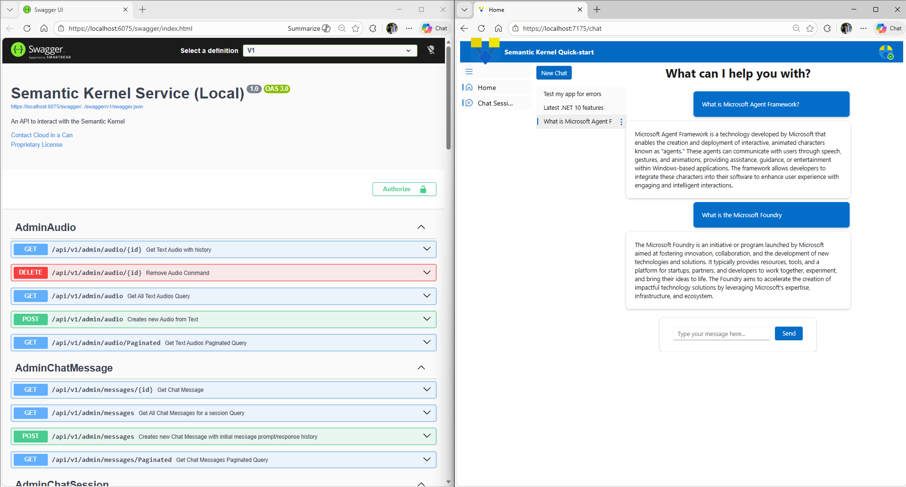

# Agent Framework C# Quick-Start
**Azure Bicep Infrastucture as Standalone Landing Zone**

[](https://github.com/goodtocode/agent-framework-quick-start/actions/workflows/gtc-agent-standalone-iac.yml)

**Clean Architecture C# Blazor Microapp and Web API Microservice**

[](https://github.com/goodtocode/agent-framework-quick-start/actions/workflows/gtc-agent-standalone-web-api-sql.yml)

Microsoft Agent Framework Quick-start is a enterprise-ready starter kit for building modern, agentic applications with C#, Blazor (Fluent UI), and ASP.NET Core Web API. This solution demonstrates how to use the Microsoft Agent Framework to create a Copilot-style chat client, fully integrated with SQL Server for persistent storage of authors, chat sessions, and messages—all orchestrated through a clean architecture pattern. 

With built-in tools (plugins) for querying and managing your own data, automated Azure infrastructure (Bicep), and seamless CI/CD (GitHub Actions), this repo provides everything you need to build, deploy, and extend real-world AI-powered apps on a traditional .NET stack—no JavaScript, no raw HTML, just pure Blazor and Fluent UI. Perfect for teams looking to modernize with AI while leveraging familiar, pragmatic enterprise patterns.



Agent Framework is an SDK that integrates Large Language Models (LLMs) like OpenAI, Azure OpenAI, and Hugging Face with conventional programming languages like C#, Python, and Java. Agent Framework allows developers to define plugins that can be chained together in just a few lines of code.

[Introduction to Microsoft Agent Framework](https://learn.microsoft.com/en-us/agent-framework/overview/)

[Getting Started with Microsoft Agent Framework](https://learn.microsoft.com/en-us/agent-framework/get-started/quick-start-guide?pivots=programming-language-csharp)

---

# Quick-Start Steps
Use one of the two copy/paste options below.

## Quick-Start: Full Setup (new or first-time environment)
```powershell
# Clone repository
git clone https://github.com/goodtocode/agent-framework-quick-start.git

# Enter repository root
cd agent-framework-quick-start

# Install .NET SDK 10
winget install Microsoft.DotNet.SDK.10 --silent

# Install EF CLI
dotnet tool install --global dotnet-ef

# Create Entra app registrations and write API/Web user-secrets
pwsh -File ./.azure/scripts/entra/New-EntraAppRegistrations.ps1 -EntraInstanceUrl "https://your-tenant-name.ciamlogin.com" -TenantId "<your-tenant-id>" -WebAppRegistrationName "myproduct-web-dev-001" -ApiAppRegistrationName "myproduct-api-dev-001" -WebProjectPath "./src/Presentation.Web" -ApiProjectPath "./src/Presentation.Api"

# Set OpenAI key in API project
cd src/Presentation.Api
dotnet user-secrets set "OpenAI:ApiKey" "YOUR_API_KEY"

# Set OpenAI key in integration test project
cd ../Tests.Integration
dotnet user-secrets init
dotnet user-secrets set "OpenAI:ApiKey" "YOUR_API_KEY"

# Return to repository root
cd ../..

# Create or update SQL schema
dotnet ef database update --project .\src\Infrastructure.SqlServer\Infrastructure.SqlServer.csproj --startup-project .\src\Presentation.Api\Presentation.Api.csproj --context AgentFrameworkContext --connection "Data Source=(localdb)\MSSQLLocalDB;Initial Catalog=AgentFramework;Min Pool Size=3;MultipleActiveResultSets=True;Trusted_Connection=Yes;TrustServerCertificate=True;MultipleActiveResultSets=False;Encrypt=True;TrustServerCertificate=False;Connection Timeout=30"

# Run integration tests
cd src/Tests.Integration
dotnet test

# Return to src and run API
cd ../
dotnet run --project Presentation.Api/Presentation.Api.csproj

# Run Web app in a second terminal
dotnet run --project Presentation.Web/Presentation.Web.csproj
```

## Quick-Start: Re-Setup for Existing Entra (no Entra setup scripts)
```powershell
# Enter repository root
cd <path-to-repo-root>

# Set API Entra secrets
cd src/Presentation.Api
dotnet user-secrets init
dotnet user-secrets set "EntraExternalId:Instance" "https://your-tenant-name.ciamlogin.com"
dotnet user-secrets set "EntraExternalId:TenantId" "TENANT_ID"
dotnet user-secrets set "EntraExternalId:ClientId" "API_CLIENT_ID"
dotnet user-secrets set "EntraExternalId:ClientSecret" "API_CLIENT_SECRET"
dotnet user-secrets set "EntraExternalId:ValidateAuthority" "true"
dotnet user-secrets set "ApplicationInsights:ConnectionString" "AZURE_MONITOR_CONNECTION_STRING"
dotnet user-secrets set "OpenAI:ApiKey" "OPEN_AI_SECRET"

# Set Web Entra secrets
cd ../Presentation.Web
dotnet user-secrets init
dotnet user-secrets set "BackendApi:ClientId" "API_CLIENT_ID"
dotnet user-secrets set "EntraExternalId:Instance" "https://your-tenant-name.ciamlogin.com"
dotnet user-secrets set "EntraExternalId:TenantId" "TENANT_ID"
dotnet user-secrets set "EntraExternalId:ClientId" "WEB_CLIENT_ID"
dotnet user-secrets set "EntraExternalId:ClientSecret" "WEB_CLIENT_SECRET"
dotnet user-secrets set "EntraExternalId:ValidateAuthority" "true"
dotnet user-secrets set "ApplicationInsights:ConnectionString" "AZURE_MONITOR_CONNECTION_STRING"

# Set integration test OpenAI secret
cd ../Tests.Integration
dotnet user-secrets init
dotnet user-secrets set "OpenAI:ApiKey" "OPEN_AI_SECRET"

# Return to repository root
cd ../..

# Create or update SQL schema
dotnet ef database update --project .\src\Infrastructure.SqlServer\Infrastructure.SqlServer.csproj --startup-project .\src\Presentation.Api\Presentation.Api.csproj --context AgentFrameworkContext --connection "Data Source=(localdb)\MSSQLLocalDB;Initial Catalog=AgentFramework;Min Pool Size=3;MultipleActiveResultSets=True;Trusted_Connection=Yes;TrustServerCertificate=True;MultipleActiveResultSets=False;Encrypt=True;TrustServerCertificate=False;Connection Timeout=30"
```

For detailed alternatives and troubleshooting, see the Authentication section below.

---

# Install Prerequisites
You will need the following tools:
## Visual Studio
[Visual Studio Workload IDs](https://learn.microsoft.com/en-us/visualstudio/install/workload-component-id-vs-community?view=visualstudio)
```
winget install --id Microsoft.VisualStudio.Community --override "--quiet --add Microsoft.Visualstudio.Workload.Azure --add Microsoft.VisualStudio.Workload.Data --add Microsoft.VisualStudio.Workload.ManagedDesktop --add Microsoft.VisualStudio.Workload.NetWeb"
```

## .NET SDK
```
winget install Microsoft.DotNet.SDK.10 --silent
```

## dotnet ef cli
Install
```
dotnet tool install --global dotnet-ef
```

## SQL Server
Visual Studio installs SQL Express. If you want full-featured SQL Server, install the SQL Server Developer Edition or above.

[SQL Server Developer Edition or above](https://www.microsoft.com/en-us/sql-server/sql-server-downloads)


# Authentication (Entra External ID)

This project uses Entra External ID (EEID) for authentication. You only need to complete ONE of the following methods (they are alternatives, not cumulative). **The preferred approach is to use the script to create both app registrations, as this will configure all required claims, roles, and scopes custom to this quick-start.**

**1. Create both app registrations and configure automatically (recommended for most users):**

If you do not have app registrations, run the script below to create both Web and API app registrations and set all user-secrets (admin consent required):

```
pwsh -File ./.azure/scripts/entra/New-EntraAppRegistrations.ps1 -EntraInstanceUrl "https://your-tenant-name.ciamlogin.com" -TenantId "<your-tenant-id>" -WebAppRegistrationName "myproduct-web-dev-001" -ApiAppRegistrationName "myproduct-api-dev-001" -WebProjectPath "./src/Presentation.Web" -ApiProjectPath "./src/Presentation.Api"
```

You will be prompted to grant admin consent in the Azure Portal twice (once for each app registration: Web and API). Look for a console message like this for each app:

```
ACTION REQUIRED: Grant admin consent for Web app permissions in the Azure Portal:
Open the following URL in your browser:
https://portal.azure.com/#view/Microsoft_AAD_RegisteredApps/ApplicationMenuBlade/~/Permissions/appId/<API or WEB APPID>/isMSAApp~/false
Then click 'Grant admin consent for ...' in the API permissions blade.
```
The script will output a summary table with all relevant IDs (TenantId, Instance, AppIds, ObjectIds, Redirect URIs, etc.) for your reference.

**2. OR: Use existing app registrations and configure .NET secrets:**

If you already have app registrations, run the following scripts to set user-secrets from your account:

```
pwsh -File ./.azure/scripts/entra/Set-ApiAppUserSecrets.ps1 -TenantId "<your-tenant-id>" -ApiAppRegistrationName "myproduct-api-dev-001" -EntraInstanceUrl "https://your-tenant-name.ciamlogin.com" -ApiProjectPath "./src/Presentation.Api"
```
```
pwsh -File ./.azure/scripts/entra/Set-WebAppUserSecrets.ps1 -TenantId "<your-tenant-id>" -WebAppRegistrationName "myproduct-web-dev-001" -ApiClientId "<api-app-client-id>" -EntraInstanceUrl "https://your-tenant-name.ciamlogin.com" -WebProjectPath "./src/Presentation.Web"
```

**3. OR: Configure everything manually:**

Set the required values using `dotnet user-secrets set` (or appsettings.local.json, not recommended for secrets):

```
cd src/Presentation.Api
dotnet user-secrets init
dotnet user-secrets set "EntraExternalId:Instance" "https://your-tenant-name.ciamlogin.com"
dotnet user-secrets set "EntraExternalId:TenantId" "<your-tenant-id>"
dotnet user-secrets set "EntraExternalId:ClientId" "<api-app-client-id>"
dotnet user-secrets set "EntraExternalId:ValidateAuthority" "true"
```

```
cd src/Presentation.Web
dotnet user-secrets init
dotnet user-secrets set "BackendApi:ClientId" "<api-app-client-id>"
dotnet user-secrets set "EntraExternalId:Instance" "https://your-tenant-name.ciamlogin.com"
dotnet user-secrets set "EntraExternalId:TenantId" "<your-tenant-id>"
dotnet user-secrets set "EntraExternalId:ClientId" "<web-app-client-id>"
dotnet user-secrets set "EntraExternalId:ValidateAuthority" "true"
dotnet user-secrets set "EntraExternalId:ClientSecret" "<web-app-client-secret>"

cd ../../
```

**EEID configuration values include:**
	- Entra Instance URL
	- Tenant ID
	- Client IDs for Web and API
	- Client secrets (if applicable)
	- Redirect URIs
	- API scopes

**Note:**
- You must use the correct Entra instance and tenant for your environment.
- The app registration names and GUIDs in the script are examples—replace them with your own values.
- For more details on Entra External ID, see [Microsoft Entra External ID documentation](https://learn.microsoft.com/en-us/azure/active-directory/external-identities/).

# Configure API Key and Connection String
Follow these steps to get your development environment set up:

## ASPNETCORE_ENVIRONMENT (informational)
This solution already sets `ASPNETCORE_ENVIRONMENT` to `Local` in each project's `Properties/launchSettings.json` for local debugging.

Set `ASPNETCORE_ENVIRONMENT` manually only when running outside launch profiles (for example custom host processes, CI/CD pipelines, containers, or alternate tooling).

  
## Setup Azure Open AI or Open AI configuration
**Important:** Do this for both Presentation.Api and Tests.Integration
### Azure Open AI
```
cd src/Presentation.Api
dotnet user-secrets set "AzureOpenAI:ChatDeploymentName" "gpt-4"
dotnet user-secrets set "AzureOpenAI:Endpoint" "https://YOUR_ENDPOINT.openai.azure.com/"
dotnet user-secrets set "AzureOpenAI:ApiKey" "YOUR_API_KEY"
cd ../Tests.Integration
dotnet user-secrets set "AzureOpenAI:ChatDeploymentName" "gpt-4"
dotnet user-secrets set "AzureOpenAI:Endpoint" "https://YOUR_ENDPOINT.openai.azure.com/"
dotnet user-secrets set "AzureOpenAI:ApiKey" "YOUR_API_KEY"
```
Alternately you can set in Environment variables
```
AzureOpenAI__ChatDeploymentName
AzureOpenAI__Endpoint
AzureOpenAI__ApiKey
```

### Open AI
Set API Key in both Presentation.Api and Tests.Integration projects
```
cd src/Presentation.Api
dotnet user-secrets set "OpenAI:ApiKey" "YOUR_API_KEY"
cd ../Tests.Integration
dotnet user-secrets set "OpenAI:ApiKey" "YOUR_API_KEY"
```
Alternately you can set in Environment variables
```
OpenAI__ChatModelId	
OpenAI__ApiKey
```

## Setup your SQL Server connection string
```
dotnet user-secrets init
dotnet user-secrets set "ConnectionStrings:DefaultConnection" "YOUR_SQL_CONNECTION_STRING"
```
# Create SQL Server Database
## dotnet ef migrate steps

1. Open Windows Terminal in Powershell or Cmd mode
2. cd to root of repository
3. Deploy new entities and configurations to database
   
	```	
	dotnet ef database update --project .\src\Infrastructure.SqlServer\Infrastructure.SqlServer.csproj --startup-project .\src\Presentation.Api\Presentation.Api.csproj --context AgentFrameworkContext --connection "Data Source=(localdb)\MSSQLLocalDB;Initial Catalog=AgentFramework;Min Pool Size=3;MultipleActiveResultSets=True;Trusted_Connection=Yes;TrustServerCertificate=True;MultipleActiveResultSets=False;Encrypt=True;TrustServerCertificate=False;Connection Timeout=30"
	```
4. When an entity changes, is created or deleted, create a new migration. Suggest doing this each new version.
	```
	dotnet ef migrations add v1.1.1 --project .\src\Infrastructure.SqlServer\Infrastructure.SqlServer.csproj --startup-project .\src\Presentation.Api\Presentation.Api.csproj --context AgentFrameworkContext
	dotnet ef database update --project .\src\Infrastructure.SqlServer\Infrastructure.SqlServer.csproj --startup-project .\src\Presentation.Api\Presentation.Api.csproj --context AgentFrameworkContext --connection "Data Source=(localdb)\MSSQLLocalDB;Initial Catalog=AgentFramework;Min Pool Size=3;MultipleActiveResultSets=True;Trusted_Connection=Yes;TrustServerCertificate=True;MultipleActiveResultSets=False;Encrypt=True;TrustServerCertificate=False;Connection Timeout=30"
	```

# Running the Application
## Launch the backend
Right-click Presentation.Api and select Set as Default Project
```
dotnet run --project src/Presentation.Api/Presentation.Api.csproj
```

## Open https://localhost:6185/swagger/index.html 
Open Microsoft Edge or modern browser
Navigate to: https://localhost:6185/swagger/index.html in your browser to the Swagger API Interface

# Github Actions for Azure IaC and CI/CD
## GitHub Actions (.github folder)

The `.github/workflows` folder contains the GitHub Actions pipelines for CI/CD. Below is a summary of the two main workflow files, their purposes, and triggers:

### Triggers
All workflow YAML files in this repo are designed to:
- **Trigger CI**: On any Pull Request (PR) to any branch (runs build/test/validate only)
- **Trigger CD**: On push to the `main` branch (runs full deployment)

| Workflow File                        | Purpose                                                                                 | CI Trigger (PR)         | CD Trigger (Push to main) |
|--------------------------------------|-----------------------------------------------------------------------------------------|-------------------------|---------------------------|
| `COMPANY-PRODUCT-api.yml`            | CI/CD for .NET Web API (build, test, deploy to Azure App Service)                       | Yes                    | Yes                      |
| `COMPANY-PRODUCT-api-sql.yml`        | CI/CD for .NET Web API with Azure SQL (includes DB migration)                           | Yes                    | Yes                      |
| `COMPANY-PRODUCT-iac.yml`            | Deploy Azure infrastructure using Bicep templates                                       | Yes                    | Yes                      |
| `COMPANY-PRODUCT-nuget.yml`          | Build, test, and publish NuGet packages                                                 | Yes                    | Yes                      |
---

### Setting up GitHub Actions to Deploy to Azure

Follow these steps to configure your environment for GitHub Actions CI/CD and Azure deployment:

**Step 1: Create EEID Web and API App Registrations**

Use the provided PowerShell script to create both the Web and API app registrations in your Entra External ID (EEID) tenant. Replace the placeholders with your actual values:

```powershell
pwsh -File ./.azure/scripts/entra/New-EntraAppRegistrations.ps1 \
	-EntraInstanceUrl "https://<your-tenant-name>.ciamlogin.com" \
	-TenantId "<your-tenant-id>" \
	-WebAppRegistrationName "<web-app-registration-name>" \
	-ApiAppRegistrationName "<api-app-registration-name>" \
	-WebProjectPath "./src/Presentation.Web" \
	-ApiProjectPath "./src/Presentation.Api"
```

This script will output the required IDs and URIs for your environment.

**Step 2: Set GitHub Environment Secrets**

Set the required secrets in your GitHub repository for the deployment workflows. You can use the provided script, replacing the placeholders with your actual values:

```powershell
$secrets = @{
	API_CLIENT_ID        = "<api-app-client-id>"
	AZURE_CLIENT_ID      = "<azure-client-id>"
	AZURE_SUBSCRIPTION_ID= "<azure-subscription-id>"
	AZURE_TENANT_ID      = "<azure-tenant-id>"
	EEID_TENANT_ID       = "<eeid-tenant-id>"
	OPENAI_APIKEY        = "<openai-api-key>"
	SQL_ADMIN_PASSWORD   = "<sql-admin-password>"
	SQL_ADMIN_USER       = "<sql-admin-user>"
	WEB_CLIENT_ID        = "<web-app-client-id>"
	WEB_CLIENT_SECRET    = "<web-app-client-secret>"
}

$secrets.GetEnumerator() | ForEach-Object {
	./.github/scripts/repo/New-GithubSecret.ps1 \
		-Owner <github-org-or-user> \
		-Repo <repo-name> \
		-Environment <environment-name> \
		-SecretName $_.Key \
		-SecretValue $_.Value
}
```

If you are using a hub-and-spoke topology, also set:

```powershell
PLATFORM_SUBSCRIPTION_ID="<platform-subscription-id>"
```

**Step 3: Federate Azure Subscription and GitHub Repo**

Run the following script to federate your Azure subscription with your GitHub repository. Replace the placeholders with your actual values:

```powershell
pwsh -File ./.github/scripts/repo/New-Github-Azure-Federation.ps1 \
	-TenantId "<azure-tenant-id>" \
	-SubscriptionId "<azure-subscription-id>" \
	-PrincipalName "<federated-identity-name>" \
	-Organization "<github-org-or-user>" \
	-Repository "<repo-name>" \
	-Environment "<environment-name>"
```

This setup ensures your GitHub Actions workflows can securely deploy to Azure using federated credentials and the required secrets.

---

# Contact
* [GitHub Repo](https://www.github.com/goodtocode/agent-framework-quick-start)
* [@goodtocode](https://www.twitter.com/goodtocode)
* [github.com/goodtocode](https://www.github.com/goodtocode)

# Technologies
* [ASP.NET Core Fluent UI](https://www.fluentui-blazor.net/)
* [ASP.NET .Net](https://docs.microsoft.com/en-us/aspnet/core/introduction-to-aspnet-core)
* [Entity Framework Core](https://docs.microsoft.com/en-us/ef/core/)

# Agent Framework
* [GitHub](https://github.com/microsoft/agentframework)
* [Getting Started Blog](https://devblogs.microsoft.com/semantic-kernel/introducing-microsoft-agent-framework/)
* [Understanding the Kernel](https://learn.microsoft.com/en-us/agent-framework/agents/kernel/?tabs=Csharp)
* [Creating Plugins](https://learn.microsoft.com/en-us/agent-framework/plugins/overview/)

## Additional Technologies References
* AspNetCore.HealthChecks.UI
* Entity Framework Core
* Microsoft.AspNetCore.App
* Microsoft.AspNetCore.Cors
* Microsoft.Aspnetcore.Fluentui
* Swashbuckle.AspNetCore.SwaggerGen
* Swashbuckle.AspNetCore.SwaggerUI

# Version History

| Version | Date        | Release Notes                                                    |
|---------|-------------|------------------------------------------------------------------|
| 1.0.0   | 2026-Feb-02 | Initial Release                                                  |

This project is licensed with the [MIT license](https://mit-license.org/).