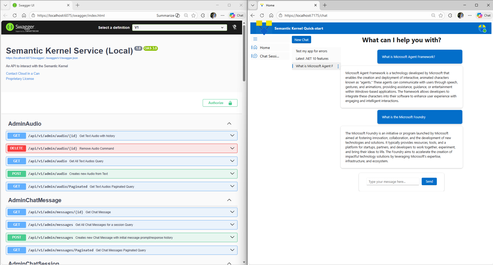

# Agent Framework C# Quick-Start
**Azure Bicep Infrastucture as Standalone Landing Zone**

[](https://github.com/goodtocode/agent-framework-quick-start/actions/workflows/gtc-agent-standalone-iac.yml)

**Clean Architecture C# Blazor Microapp and Web API Microservice**

[](https://github.com/goodtocode/agent-framework-quick-start/actions/workflows/gtc-agent-standalone-web-api-sql-aoai.yml)

Microsoft Agent Framework Quick-start is a enterprise-ready starter kit for building modern, agentic applications with C#, Blazor (Fluent UI), and ASP.NET Core Web API. This solution demonstrates how to use the Microsoft Agent Framework to create a Copilot-style chat client, fully integrated with SQL Server for persistent storage of authors, chat sessions, and messages—all orchestrated through a clean architecture pattern. 

With built-in tools (plugins) for querying and managing your own data, automated Azure infrastructure (Bicep), and seamless CI/CD (GitHub Actions), this repo provides everything you need to build, deploy, and extend real-world AI-powered apps on a traditional .NET stack—no JavaScript, no raw HTML, just pure Blazor and Fluent UI. Perfect for teams looking to modernize with AI while leveraging familiar, pragmatic enterprise patterns.



Agent Framework is an SDK that integrates Large Language Models (LLMs) like OpenAI, Azure OpenAI, and Hugging Face with conventional programming languages like C#, Python, and Java. Agent Framework allows developers to define plugins that can be chained together in just a few lines of code.

[Introduction to Microsoft Agent Framework](https://learn.microsoft.com/en-us/agent-framework/overview/)

[Getting Started with Microsoft Agent Framework](https://learn.microsoft.com/en-us/agent-framework/get-started/quick-start-guide?pivots=programming-language-csharp)

---

# Quick-Start Steps
Use one of the two copy/paste options below.

## Quick-Start: Full Setup (new or first-time environment)
```powershell
# Clone repository
git clone https://github.com/goodtocode/agent-framework-quick-start.git

# Enter repository root
cd agent-framework-quick-start

# Install .NET SDK 10
winget install Microsoft.DotNet.SDK.10 --silent

# Trust local ASP.NET Core HTTPS development certificate (first-time machine setup)
dotnet dev-certs https --trust

# Install EF CLI
dotnet tool install --global dotnet-ef

# Create Entra app registrations and write API/Web user-secrets
pwsh -File ./.azure/scripts/entra/New-EntraAppRegistrations.ps1 -EntraInstanceUrl "https://your-tenant-name.ciamlogin.com" -TenantId "<your-tenant-id>" -WebAppRegistrationName "myproduct-web-dev-001" -ApiAppRegistrationName "myproduct-api-dev-001" -WebProjectPath "./src/Presentation.Web" -ApiProjectPath "./src/Presentation.Api" -WebRedirectUri "https://localhost:6195/signin-oidc" -WebLogoutUri "https://localhost:6195/signout-callback-oidc"

# IMPORTANT: WebRedirectUri/WebLogoutUri must match your local Web app launchSettings URL/port.
# If your Presentation.Web Properties/launchSettings.json uses a different HTTPS port, update both values above.

# Set API provider to Azure OpenAI
cd src/Presentation.Api
dotnet user-secrets set "AgentProvider:Kind" "AzureOpenAI"

# Set Azure OpenAI settings in API project
dotnet user-secrets set "AzureOpenAI:ChatDeploymentName" "gpt-4"
dotnet user-secrets set "AzureOpenAI:Endpoint" "https://YOUR_ENDPOINT.openai.azure.com/"
dotnet user-secrets set "AzureOpenAI:ApiKey" "YOUR_API_KEY"

# Set Azure OpenAI settings in integration test project
cd ../Tests.Integration
dotnet user-secrets init
dotnet user-secrets set "AzureOpenAI:ChatDeploymentName" "gpt-4"
dotnet user-secrets set "AzureOpenAI:Endpoint" "https://YOUR_ENDPOINT.openai.azure.com/"
dotnet user-secrets set "AzureOpenAI:ApiKey" "YOUR_API_KEY"

# Return to repository root
cd ../..

# Create or update SQL schema
dotnet ef database update --project .\src\Infrastructure.SqlServer\Infrastructure.SqlServer.csproj --startup-project .\src\Presentation.Api\Presentation.Api.csproj --context AgentFrameworkContext --connection "Data Source=(localdb)\MSSQLLocalDB;Initial Catalog=AgentFramework;Min Pool Size=3;MultipleActiveResultSets=True;Trusted_Connection=Yes;TrustServerCertificate=True;MultipleActiveResultSets=False;Encrypt=True;TrustServerCertificate=False;Connection Timeout=30"

# Run integration tests
cd src/Tests.Integration
dotnet test

# Return to src and run API
cd ../
dotnet run --project Presentation.Api/Presentation.Api.csproj

# Run Web app in a second terminal
dotnet run --project Presentation.Web/Presentation.Web.csproj
```

## Quick-Start: Re-Setup for Existing Entra (no Entra setup scripts)
```powershell
# Enter repository root
cd <path-to-repo-root>

# Set API Entra secrets
cd src/Presentation.Api
dotnet user-secrets init
dotnet user-secrets set "EntraExternalId:Instance" "https://your-tenant-name.ciamlogin.com"
dotnet user-secrets set "EntraExternalId:TenantId" "TENANT_ID"
dotnet user-secrets set "EntraExternalId:ClientId" "API_CLIENT_ID"
dotnet user-secrets set "EntraExternalId:ValidateAuthority" "true"
dotnet user-secrets set "ApplicationInsights:ConnectionString" "AZURE_MONITOR_CONNECTION_STRING"
dotnet user-secrets set "AgentProvider:Kind" "AzureOpenAI"
dotnet user-secrets set "AzureOpenAI:ChatDeploymentName" "gpt-4"
dotnet user-secrets set "AzureOpenAI:Endpoint" "https://YOUR_ENDPOINT.openai.azure.com/"
dotnet user-secrets set "AzureOpenAI:ApiKey" "YOUR_API_KEY"

# Set Web Entra secrets
cd ../Presentation.Web
dotnet user-secrets init
dotnet user-secrets set "BackendApi:ClientId" "API_CLIENT_ID"
dotnet user-secrets set "EntraExternalId:Instance" "https://your-tenant-name.ciamlogin.com"
dotnet user-secrets set "EntraExternalId:TenantId" "TENANT_ID"
dotnet user-secrets set "EntraExternalId:ClientId" "WEB_CLIENT_ID"
dotnet user-secrets set "EntraExternalId:PasswordResetUrl" "https://your-tenant-name.ciamlogin.com/TENANT_ID/oauth2/v2.0/authorize?p=B2C_1_passwordreset"
dotnet user-secrets set "EntraExternalId:ValidateAuthority" "true"
dotnet user-secrets set "EntraExternalId:ClientSecret" "WEB_CLIENT_SECRET"
dotnet user-secrets set "ApplicationInsights:ConnectionString" "AZURE_MONITOR_CONNECTION_STRING"

# Set integration test Azure OpenAI settings
cd ../Tests.Integration
dotnet user-secrets init
dotnet user-secrets set "AzureOpenAI:ChatDeploymentName" "gpt-4"
dotnet user-secrets set "AzureOpenAI:Endpoint" "https://YOUR_ENDPOINT.openai.azure.com/"
dotnet user-secrets set "AzureOpenAI:ApiKey" "YOUR_API_KEY"

# Return to repository root
cd ../..

# Create or update SQL schema
dotnet ef database update --project .\src\Infrastructure.SqlServer\Infrastructure.SqlServer.csproj --startup-project .\src\Presentation.Api\Presentation.Api.csproj --context AgentFrameworkContext --connection "Data Source=(localdb)\MSSQLLocalDB;Initial Catalog=AgentFramework;Min Pool Size=3;MultipleActiveResultSets=True;Trusted_Connection=Yes;TrustServerCertificate=True;MultipleActiveResultSets=False;Encrypt=True;TrustServerCertificate=False;Connection Timeout=30"
```

For detailed alternatives and troubleshooting, see the Authentication section below.

---

# Install Prerequisites
You will need the following tools:
## Visual Studio
[Visual Studio Workload IDs](https://learn.microsoft.com/en-us/visualstudio/install/workload-component-id-vs-community?view=visualstudio)
```
winget install --id Microsoft.VisualStudio.Community --override "--quiet --add Microsoft.Visualstudio.Workload.Azure --add Microsoft.VisualStudio.Workload.Data --add Microsoft.VisualStudio.Workload.ManagedDesktop --add Microsoft.VisualStudio.Workload.NetWeb"
```

## .NET SDK
```
winget install Microsoft.DotNet.SDK.10 --silent
```

## ASP.NET Core HTTPS development certificate
Trust the local development certificate once per machine/user profile to avoid browser trust prompts when launching local HTTPS endpoints.

```
dotnet dev-certs https --trust
```

This command is safe to run multiple times. If a trusted development certificate already exists, it does not damage or replace your environment unexpectedly.

## dotnet ef cli
Install
```
dotnet tool install --global dotnet-ef
```

## SQL Server
Visual Studio installs SQL Express. If you want full-featured SQL Server, install the SQL Server Developer Edition or above.

[SQL Server Developer Edition or above](https://www.microsoft.com/en-us/sql-server/sql-server-downloads)


# Authentication (Entra External ID)

This project uses Entra External ID (EEID) for authentication. You only need to complete ONE of the following methods (they are alternatives, not cumulative). **The preferred approach is to use the script to create both app registrations, as this will configure all required claims, roles, and scopes custom to this quick-start.**

For this solution:
- `Presentation.Api` is a resource API and validates bearer tokens. It does **not** require `EntraExternalId:ClientSecret`.
- `Presentation.Web` uses interactive sign-in and requires `EntraExternalId:PasswordResetUrl` in addition to instance/tenant/client settings.

**1. Create both app registrations and configure automatically (recommended for most users):**

If you do not have app registrations, run the script below to create both Web and API app registrations and set all user-secrets (admin consent required):

```
pwsh -File ./.azure/scripts/entra/New-EntraAppRegistrations.ps1 -EntraInstanceUrl "https://your-tenant-name.ciamlogin.com" -TenantId "<your-tenant-id>" -WebAppRegistrationName "myproduct-web-dev-001" -ApiAppRegistrationName "myproduct-api-dev-001" -WebProjectPath "./src/Presentation.Web" -ApiProjectPath "./src/Presentation.Api" -WebRedirectUri "https://localhost:6195/signin-oidc" -WebLogoutUri "https://localhost:6195/signout-callback-oidc"
```

`-WebRedirectUri` and `-WebLogoutUri` must match your local Web app `Properties/launchSettings.json` HTTPS URL/port.

### Verify Entra setup (single script)

Run one script to verify the common EEID prerequisites for local .NET Web -> API delegated auth, including:
- Web redirect/logout URIs
- API scope exposure (`access_as_user`)
- Web required API permission wiring
- Web/API service principal existence
- Consent grant presence (the core `AADSTS65001` check)

```powershell
pwsh -File ./.azure/scripts/entra/Verify-EntraSetup.ps1 -TenantId "<your-tenant-id>" -WebAppRegistrationName "myproduct-web-dev-001" -ApiAppRegistrationName "myproduct-api-dev-001" -ExpectedRedirectUri "https://localhost:6195/signin-oidc" -ExpectedLogoutUri "https://localhost:6195/signout-callback-oidc"
```

Exit code behavior:
- `0`: verification passed with no blocking failures.
- `1`: one or more blocking failures detected; script output includes the failing checks and the Web app consent blade URL.

You will be prompted to grant admin consent in the Azure Portal twice (once for each app registration: Web and API). Look for a console message like this for each app:

```
ACTION REQUIRED: Grant admin consent for Web app permissions in the Azure Portal:
Open the following URL in your browser:
https://portal.azure.com/#view/Microsoft_AAD_RegisteredApps/ApplicationMenuBlade/~/Permissions/appId/<API or WEB APPID>/isMSAApp~/false
Then click 'Grant admin consent for ...' in the API permissions blade.
```
The script will output a summary table with all relevant IDs (TenantId, Instance, AppIds, ObjectIds, Redirect URIs, etc.) for your reference.

**2. OR: Use existing app registrations and configure .NET secrets:**

If you already have app registrations, run the following scripts to set user-secrets from your account:

```
pwsh -File ./.azure/scripts/entra/Set-ApiAppUserSecrets.ps1 -TenantId "<your-tenant-id>" -ApiAppRegistrationName "myproduct-api-dev-001" -EntraInstanceUrl "https://your-tenant-name.ciamlogin.com" -ApiProjectPath "./src/Presentation.Api"
```
```
pwsh -File ./.azure/scripts/entra/Set-WebAppUserSecrets.ps1 -TenantId "<your-tenant-id>" -WebAppRegistrationName "myproduct-web-dev-001" -ApiClientId "<api-app-client-id>" -EntraInstanceUrl "https://your-tenant-name.ciamlogin.com" -PasswordResetPolicyName "B2C_1_passwordreset" -WebClientSecret "<web-app-client-secret>" -WebProjectPath "./src/Presentation.Web"
```

**3. OR: Configure everything manually:**

Set the required values using `dotnet user-secrets set` (or appsettings.local.json, not recommended for secrets):

```
cd src/Presentation.Api
dotnet user-secrets init
dotnet user-secrets set "EntraExternalId:Instance" "https://your-tenant-name.ciamlogin.com"
dotnet user-secrets set "EntraExternalId:TenantId" "<your-tenant-id>"
dotnet user-secrets set "EntraExternalId:ClientId" "<api-app-client-id>"
dotnet user-secrets set "EntraExternalId:ValidateAuthority" "true"
```

```
cd src/Presentation.Web
dotnet user-secrets init
dotnet user-secrets set "BackendApi:ClientId" "<api-app-client-id>"
dotnet user-secrets set "EntraExternalId:Instance" "https://your-tenant-name.ciamlogin.com"
dotnet user-secrets set "EntraExternalId:TenantId" "<your-tenant-id>"
dotnet user-secrets set "EntraExternalId:ClientId" "<web-app-client-id>"
dotnet user-secrets set "EntraExternalId:PasswordResetUrl" "https://your-tenant-name.ciamlogin.com/<your-tenant-id>/oauth2/v2.0/authorize?p=B2C_1_passwordreset"
dotnet user-secrets set "EntraExternalId:ValidateAuthority" "true"
dotnet user-secrets set "EntraExternalId:ClientSecret" "<web-app-client-secret>"

cd ../../
```

**EEID configuration values include:**
	- Entra Instance URL
	- Tenant ID
	- Client IDs for Web and API
	- Web Password Reset URL (`EntraExternalId:PasswordResetUrl`)
	- Web client secret (for interactive web auth)
	- Redirect URIs
	- API scopes

**Note:**
- You must use the correct Entra instance and tenant for your environment.
- The app registration names and GUIDs in the script are examples—replace them with your own values.
- For more details on Entra External ID, see [Microsoft Entra External ID documentation](https://learn.microsoft.com/en-us/azure/active-directory/external-identities/).

# Configure API Key and Connection String
Follow these steps to get your development environment set up:

## ASPNETCORE_ENVIRONMENT (informational)
This solution already sets `ASPNETCORE_ENVIRONMENT` to `Local` in each project's `Properties/launchSettings.json` for local debugging.

Set `ASPNETCORE_ENVIRONMENT` manually only when running outside launch profiles (for example custom host processes, CI/CD pipelines, containers, or alternate tooling).

  
## Setup AI provider configuration (Azure OpenAI default)
**Important:** Set the provider in Presentation.Api and configure Azure OpenAI values.
### Azure OpenAI (default)
```
cd src/Presentation.Api
dotnet user-secrets set "AgentProvider:Kind" "AzureOpenAI"
dotnet user-secrets set "AzureOpenAI:ChatDeploymentName" "gpt-4"
dotnet user-secrets set "AzureOpenAI:Endpoint" "https://YOUR_ENDPOINT.openai.azure.com/"
dotnet user-secrets set "AzureOpenAI:ApiKey" "YOUR_API_KEY"
cd ../Tests.Integration
dotnet user-secrets init
dotnet user-secrets set "AzureOpenAI:ChatDeploymentName" "gpt-4"
dotnet user-secrets set "AzureOpenAI:Endpoint" "https://YOUR_ENDPOINT.openai.azure.com/"
dotnet user-secrets set "AzureOpenAI:ApiKey" "YOUR_API_KEY"
```
Alternately you can set in Environment variables
```
AzureOpenAI__ChatDeploymentName
AzureOpenAI__Endpoint
AzureOpenAI__ApiKey
```

### OpenAI (optional fallback)
Set provider and API key only if you want OpenAI instead of Azure OpenAI.
```
cd src/Presentation.Api
dotnet user-secrets set "AgentProvider:Kind" "OpenAI"
dotnet user-secrets set "OpenAI:ApiKey" "YOUR_API_KEY"
cd ../Tests.Integration
dotnet user-secrets set "OpenAI:ApiKey" "YOUR_API_KEY"
```
Alternately you can set in Environment variables
```
OpenAI__ChatModelId	
OpenAI__ApiKey
```

## Setup your SQL Server connection string
```
dotnet user-secrets init
dotnet user-secrets set "ConnectionStrings:DefaultConnection" "YOUR_SQL_CONNECTION_STRING"
```
# Create SQL Server Database
## dotnet ef migrate steps

1. Open Windows Terminal in Powershell or Cmd mode
2. cd to root of repository
3. Deploy new entities and configurations to database
   
	```	
	dotnet ef database update --project .\src\Infrastructure.SqlServer\Infrastructure.SqlServer.csproj --startup-project .\src\Presentation.Api\Presentation.Api.csproj --context AgentFrameworkContext --connection "Data Source=(localdb)\MSSQLLocalDB;Initial Catalog=AgentFramework;Min Pool Size=3;MultipleActiveResultSets=True;Trusted_Connection=Yes;TrustServerCertificate=True;MultipleActiveResultSets=False;Encrypt=True;TrustServerCertificate=False;Connection Timeout=30"
	```
4. When an entity changes, is created or deleted, create a new migration. Suggest doing this each new version.
	```
	dotnet ef migrations add v1.1.1 --project .\src\Infrastructure.SqlServer\Infrastructure.SqlServer.csproj --startup-project .\src\Presentation.Api\Presentation.Api.csproj --context AgentFrameworkContext
	dotnet ef database update --project .\src\Infrastructure.SqlServer\Infrastructure.SqlServer.csproj --startup-project .\src\Presentation.Api\Presentation.Api.csproj --context AgentFrameworkContext --connection "Data Source=(localdb)\MSSQLLocalDB;Initial Catalog=AgentFramework;Min Pool Size=3;MultipleActiveResultSets=True;Trusted_Connection=Yes;TrustServerCertificate=True;MultipleActiveResultSets=False;Encrypt=True;TrustServerCertificate=False;Connection Timeout=30"
	```

# Running the Application
## Launch the backend
Right-click Presentation.Api and select Set as Default Project
```
dotnet run --project src/Presentation.Api/Presentation.Api.csproj
```

## Open https://localhost:6185/swagger/index.html 
Open Microsoft Edge or modern browser
Navigate to: https://localhost:6185/swagger/index.html in your browser to the Swagger API Interface

# Example Playbooks (Collect → Evaluate → Record)

This quick-start ships with three example **Playbook** workflows built on
[`Goodtocode.Agents.Playbook`](https://www.nuget.org/packages/Goodtocode.Agents.Playbook) and
governed end-to-end with [`Goodtocode.Agents.Governance`](https://www.nuget.org/packages/Goodtocode.Agents.Governance).
A Playbook is a 3-stage **Collect → Evaluate → Record (CER)** pipeline: Collect gathers evidence,
Evaluate judges that evidence against a versioned rubric, and Record shapes the judged outcome into
a display- and persistence-ready result. CER is the architectural abstraction; Microsoft Agent
Framework (MAF) is just **one** orchestration strategy capable of running CER stages — it is not a
requirement of the pattern itself. These three examples intentionally span the full range from
"no model involved" to "every stage is a model call," so the differences between them teach exactly
what agentic orchestration adds (and when you don't need it):

| # | Playbook | Collect | Evaluate | Record | Orchestration | Feature Doc |
|---|----------|---------|----------|--------|----------------|-------------|
| 1 | SQL Statistics Classification | Deterministic | Deterministic | Deterministic | `PlaybookExecutor` directly, no MAF | [feature-playbook-sql-statistics.md](./docs/product/features/feature-playbook-sql-statistics.md) |
| 2 | Taxonomy Extraction and Classification | Agentic | Agentic | Agentic | MAF `WorkflowBuilder` / `InProcessExecution`, 3-node graph | [feature-playbook-taxonomy.md](./docs/product/features/feature-playbook-taxonomy.md) |
| 3 | Essay Rubric Evaluation | Deterministic | Agentic | Deterministic | Same MAF 3-node graph shape as #2; only the Evaluate tool differs | [feature-playbook-essay.md](./docs/product/features/feature-playbook-essay.md) |

Workflow 3 (Essay) is the **recommended real-world pattern**: deterministic evidence retrieval and
deterministic materialization surrounding a single, tightly-scoped agentic reasoning stage — model
involvement only where judgment is genuinely required, with the surrounding arithmetic and shaping
staying fully replayable.

## Unified Shape Across All Three Playbooks

To keep the examples easy to compare and easy to extend, all three follow one common
input/criteria/output convention:

- **Collect input is always a plain `string`.** There is no Playbook-specific request wrapper type
  at the stage boundary — SQL Statistics takes a database name, Taxonomy takes free text to extract
  terms from, and Essay takes the essay text itself. When the real source of that string is
  something richer (for example, an existing chat message for Essay), resolving it happens
  **outside** the Playbook, in the calling command handler — never inside a Collect-stage tool.
- **Evaluation criteria are always supplied through the same type:** the package's generic
  `PlaybookKnowledge`/`EvaluationRubric`/`EvaluationCriterion`/`IEvaluationScale` shape, exposed per
  workflow through a thin `IPlaybookKnowledgeHolder` singleton (`SqlStatisticsKnowledgeHolder.V1`,
  `TaxonomyKnowledgeHolder.V1`, `EssayKnowledgeHolder.V1`). Only the criteria *data* differs between
  workflows — the type that carries it never does.
- **Record output is always reachable as a plain `string` summary**, in addition to whatever richer
  typed materialization each workflow also produces, via the shared `result.Summary()` extension
  method.

Every stage execution of every Playbook produces a governed `EvaluationGovernanceRecord`
(observability, auditability, defensibility, repeatability) per
[`docs/governance/ai-policy.md`](./docs/governance/ai-policy.md), and the recorded
`Repeatability.DeterministicReplaySupported` flag correctly reflects whether that specific stage
was deterministic or agentic. See
[`docs/governance/playbook-workflow-types.md`](./docs/governance/playbook-workflow-types.md) for
the full architectural write-up, including project-boundary rules and the MAF adapter placement
decision.

## Playbook Catalog vs. Playbook Execution

The Playbook *concept* and a Playbook *run* are persisted as two separate kinds of entity:

- **Catalog** (`PlaybookEntity` + `PlaybookStepEntity`, `Core.Domain/Playbooks`): the semi-static
  definition of each of the three Playbooks above — its `Name`/`Description`/`WorkflowType`, and
  its three CER steps, each with a persisted `ActionFormat` and `ActionDefinition` (the actual SQL
  query, rubric, prompt, or projection template that step runs). This is shared, unsecured
  reference data, seeded once at startup, and fully CRUD-able through
  `api/v{version}/playbooks` (`PlaybookCatalogEndpoints`).
- **Execution** (`PlaybookExecutionEntity`, `Core.Domain/Playbooks`): one owner/tenant-scoped
  record per run, capturing `CollectInput` plus the `CollectOutput`/`EvaluateOutput`/`RecordOutput`
  strings produced that run, a foreign key back to the catalog `PlaybookEntity`, and repeatability
  metadata (`ReplayMode`, `SourceExecutionId`).

See `docs/governance/playbook-workflow-types.md` ("Persistence: Playbook Catalog vs. Playbook
Execution") for the full entity model.

These three Playbooks are exposed both as REST endpoints (`api/v{version}/my/playbooks/{sql-statistics,taxonomy,essay}`
to run, `api/v{version}/playbooks` to manage the catalog) and as Blazor pages under `/playbooks/*`
in Presentation.Web, in addition to being proven through `Tests.Integration` — see each feature
doc's **UI Changes** and **API Changes** sections for details.

# Github Actions for Azure IaC and CI/CD
## GitHub Actions (.github folder)

The `.github/workflows` folder contains the GitHub Actions pipelines for CI/CD. Below is a summary of the two main workflow files, their purposes, and triggers:

### Triggers
All workflow YAML files in this repo are designed to:
- **Trigger CI**: On any Pull Request (PR) to any branch (runs build/test/validate only)
- **Trigger CD**: On push to the `main` branch (runs full deployment)

| Workflow File                        | Purpose                                                                                 | CI Trigger (PR)         | CD Trigger (Push to main) |
|--------------------------------------|-----------------------------------------------------------------------------------------|-------------------------|---------------------------|
| `COMPANY-PRODUCT-api.yml`            | CI/CD for .NET Web API (build, test, deploy to Azure App Service)                       | Yes                    | Yes                      |
| `COMPANY-PRODUCT-api-sql.yml`        | CI/CD for .NET Web API with Azure SQL (includes DB migration)                           | Yes                    | Yes                      |
| `COMPANY-PRODUCT-iac.yml`            | Deploy Azure infrastructure using Bicep templates                                       | Yes                    | Yes                      |
| `COMPANY-PRODUCT-nuget.yml`          | Build, test, and publish NuGet packages                                                 | Yes                    | Yes                      |
---

### Setting up GitHub Actions to Deploy to Azure

Follow these steps to configure your environment for GitHub Actions CI/CD and Azure deployment:

**Step 1: Create EEID Web and API App Registrations**

Use the provided PowerShell script to create both the Web and API app registrations in your Entra External ID (EEID) tenant. Replace the placeholders with your actual values:

```powershell
pwsh -File ./.azure/scripts/entra/New-EntraAppRegistrations.ps1 \
	-EntraInstanceUrl "https://<your-tenant-name>.ciamlogin.com" \
	-TenantId "<your-tenant-id>" \
	-WebAppRegistrationName "<web-app-registration-name>" \
	-ApiAppRegistrationName "<api-app-registration-name>" \
	-WebProjectPath "./src/Presentation.Web" \
	-ApiProjectPath "./src/Presentation.Api" \
	-WebRedirectUri "https://localhost:6195/signin-oidc" \
	-WebLogoutUri "https://localhost:6195/signout-callback-oidc"
```

Make sure the redirect/logout URIs match your local `Presentation.Web` launch profile HTTPS URL.

This script will output the required IDs and URIs for your environment.

**Step 2: Set GitHub Environment Secrets**

Set the required secrets in your GitHub repository for the deployment workflows. You can use the provided script, replacing the placeholders with your actual values:

```powershell
$secrets = @{
	API_CLIENT_ID        = "<api-app-client-id>"
	AZURE_CLIENT_ID      = "<azure-client-id>"
	AZURE_SUBSCRIPTION_ID= "<azure-subscription-id>"
	AZURE_TENANT_ID      = "<azure-tenant-id>"
	EEID_TENANT_ID       = "<eeid-tenant-id>"
	OPENAI_APIKEY        = "<openai-api-key>"
	SQL_ADMIN_PASSWORD   = "<sql-admin-password>"
	SQL_ADMIN_USER       = "<sql-admin-user>"
	WEB_CLIENT_ID        = "<web-app-client-id>"
	WEB_CLIENT_SECRET    = "<web-app-client-secret>"
}

$secrets.GetEnumerator() | ForEach-Object {
	./.github/scripts/repo/New-GithubSecret.ps1 \
		-Owner <github-org-or-user> \
		-Repo <repo-name> \
		-Environment <environment-name> \
		-SecretName $_.Key \
		-SecretValue $_.Value
}
```

If you are using a hub-and-spoke topology, also set:

```powershell
PLATFORM_SUBSCRIPTION_ID="<platform-subscription-id>"
```

**Step 3: Federate Azure Subscription and GitHub Repo**

Run the following script to federate your Azure subscription with your GitHub repository. Replace the placeholders with your actual values:

```powershell
pwsh -File ./.github/scripts/repo/New-Github-Azure-Federation.ps1 \
	-TenantId "<azure-tenant-id>" \
	-SubscriptionId "<azure-subscription-id>" \
	-PrincipalName "<federated-identity-name>" \
	-Organization "<github-org-or-user>" \
	-Repository "<repo-name>" \
	-Environment "<environment-name>"
```

This setup ensures your GitHub Actions workflows can securely deploy to Azure using federated credentials and the required secrets.

---

# Contact
* [GitHub Repo](https://www.github.com/goodtocode/agent-framework-quick-start)
* [@goodtocode](https://www.twitter.com/goodtocode)
* [github.com/goodtocode](https://www.github.com/goodtocode)

# Technologies
* [ASP.NET Core Fluent UI](https://www.fluentui-blazor.net/)
* [ASP.NET .Net](https://docs.microsoft.com/en-us/aspnet/core/introduction-to-aspnet-core)
* [Entity Framework Core](https://docs.microsoft.com/en-us/ef/core/)

# Agent Framework
* [GitHub](https://github.com/microsoft/agentframework)
* [Getting Started Blog](https://devblogs.microsoft.com/semantic-kernel/introducing-microsoft-agent-framework/)
* [Understanding the Kernel](https://learn.microsoft.com/en-us/agent-framework/agents/kernel/?tabs=Csharp)
* [Creating Plugins](https://learn.microsoft.com/en-us/agent-framework/plugins/overview/)

## Additional Technologies References
* AspNetCore.HealthChecks.UI
* Entity Framework Core
* Microsoft.AspNetCore.App
* Microsoft.AspNetCore.Cors
* Microsoft.Aspnetcore.Fluentui
* Swashbuckle.AspNetCore.SwaggerGen
* Swashbuckle.AspNetCore.SwaggerUI

# Version History

| Version | Date        | Release Notes                                                    |
|---------|-------------|------------------------------------------------------------------|
| 1.0.0   | 2026-Feb-02 | Initial Release                                                  |
| 1.1.0   | 2026-Jul-27 | AI-ize md/yml, AgentProvider                                     |

This project is licensed with the [MIT license](https://mit-license.org/).