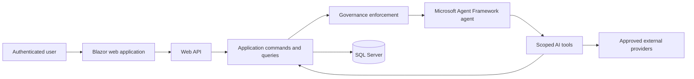

# Context Diagram

## Purpose

Define the baseline system boundary and runtime relationships for the Agent Framework Quick Start.

This document establishes where identity, application behavior, governance, agent execution, tools, persistence, and approved external providers belong before feature implementation.

---

## Context Diagram



---

## Boundary Rules

- The Blazor web application interacts with the system through typed API clients; it never accesses persistence directly.
- The API delegates business execution to Application commands and queries.
- Governance is enforced before every model inference and contributes the system instruction used by the agent runtime.
- Tools are Infrastructure adapters. They dispatch typed application requests through the scoped execution gateway and do not access persistence directly.
- Application handlers own validation, owner/tenant scope, business rules, and persistence orchestration.
- External providers are reached only through approved Infrastructure adapters.

---

## Baseline Runtime Flow

```text
Authenticated user
    -> Chat request
        -> Application validation and user context
            -> Governance enforcement
                -> Agent inference
                    -> Optional scoped tool request
                        -> Application handler
                            -> SQL Server or approved external provider
```

The same flow applies whether the user enters a message directly, selects a suggested prompt, or selects a follow-up action.