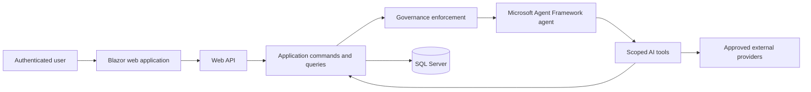

# Context Diagram

The web application never accesses persistence directly. Tools are infrastructure adapters that invoke typed application requests. Governance is applied before each model inference.